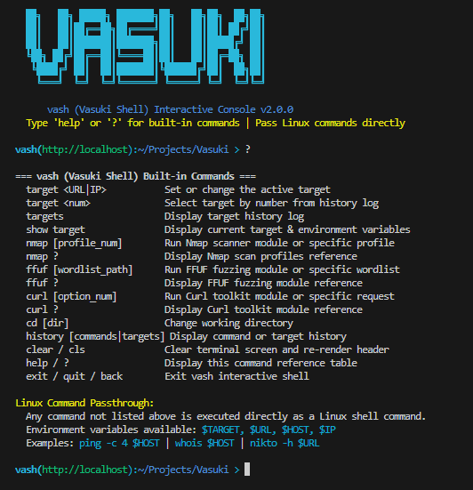
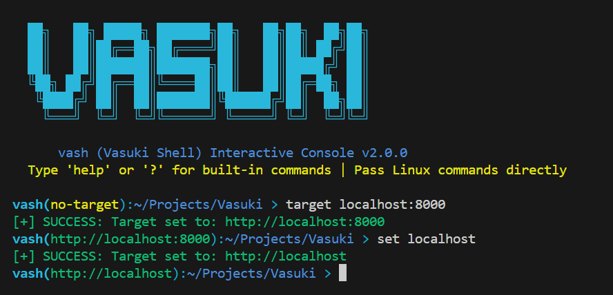
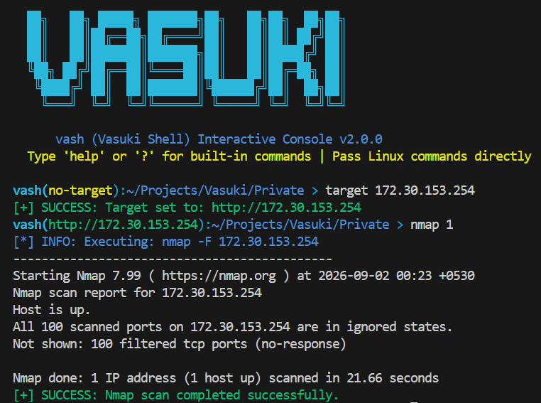
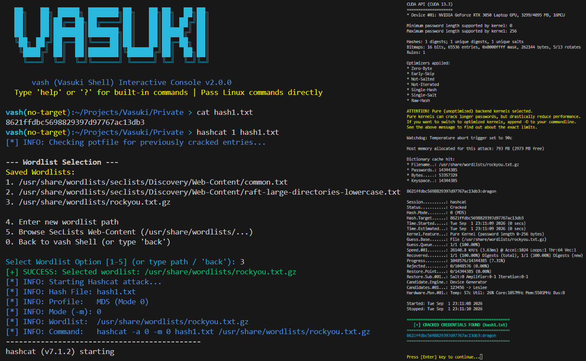

# `vash` (Vasuki Shell) Architectural & Technical Specification

## Project Overview

`vash` (**Vasuki Shell**) is a modular, interactive Read-Eval-Print Loop (REPL) reconnaissance console written in Bash. It automates common security tasks around underlying tools (`nmap`, `ffuf`, `curl`, `hashcat`) while providing a shell interface featuring:

- **Stateful Target Management**: Tracks an active target string across tool invocations and exports environment variables (`$TARGET`, `$URL`, `$HOST`, `$IP`).
- **Dynamic Prompt Formatting**: Displays target status and current working directory in the prompt (e.g. `vash(http://10.10.10.10):~/Projects >`).
- **Native Linux Passthrough**: Automatically evaluates non-builtin commands in the host environment with target variables bound.
- **Persistent State Logging**: Retains command history, target history, and user-provided wordlist paths under `~/.config/vasuki/`.
- **Target-Independent Sub-Module Help**: Displays tool profile references without requiring an active target (`nmap ?`, `ffuf ?`, `curl ?`, `hashcat ?`).
- **Potfile Auto-Check & Instant Credential Viewing**: Automatically checks Hashcat's `.potfile` before wordlist attacks and provides `hashcat show <file>` for instant cracked hash viewing.
- **Instant Interrupt Handling**: Traps `SIGINT` (`Ctrl+C`) to reset the prompt instantly with zero delay or blocking.

---
<p align="center">
  
</p>
<p align="center"> vash (Vasuki Shell)</p>

---

## High-Level System Architecture

```
                       +-----------------------------------+
                       |    vash Launcher (Vasuki)         |
                       |  - Readline Loop (vash_repl)      |
                       |  - Instant SIGINT (Ctrl+C) Handler |
                       +-----------------+-----------------+
                                         |
                                         v
                       +-----------------------------------+
                       |    Core Subsystems (common.sh)    |
                       |  - Target Normalization & Export  |
                       |  - History Log Managers           |
                       |  - Interactive Wordlist Picker    |
                       +-----------------+-----------------+
                                         |
     +-------------------+---------------+---------------+-------------------+
     |                   |                               |                   |
     v                   v                               v                   v
+----------+       +-----------+                   +-----------+       +------------+
| Nmap     |       | FFUF      |                   | Curl      |       | Hashcat    |
| Module   |       | Module    |                   | Module    |       | Module     |
|(nmap.sh) |       | (ffuf.sh) |                   | (curl.sh) |       |(hashcat.sh)|
+----------+       +-----+-----+                   +-----------+       +------------+
                         |
                         v
               +-------------------+
               |  SecLists Finder  |
               |   (seclists.sh)   |
               +-------------------+
```

---

## File Hierarchy & Responsibilities

| File | Purpose & Primary Responsibilities |
| :--- | :--- |
| `Vasuki` | **Main Entry Point & REPL Launcher**: Initializes signal handlers (`SIGTERM` & instant `SIGINT`), executes dependency checks, manages readline command loops, handles target switching, routes built-in commands, and passes unhandled commands to host shell. |
| `config.sh` | **Central Configuration Store**: Defines program constants (`PROGRAM_NAME`, `SHELL_NAME`, `VERSION`), persistent directory paths (`VASUKI_CONFIG_DIR`, `TARGET_HISTORY_FILE`, `COMMAND_HISTORY_FILE`, `SAVED_WORDLISTS_FILE`), and ANSI color tokens. |
| `common.sh` | **Core Helper Library**: Contains UI formatting functions (`banner`, `menu_header`), input validation/normalization routines (`validate_target`, `normalize_target`), target environment exporter (`export_target_environment`), persistent logging logic, and the interactive wordlist selector (`select_wordlist`). |
| `nmap.sh` | **Nmap Module**: Exposes `run_nmap()`. Extracts clean hostnames/IPs from target URLs, handles direct profile arguments (e.g. `nmap 1`), renders categorized scan profiles (Basic, Moderate, Advanced), and executes `nmap ?` help reference without target prerequisites. |
| `ffuf.sh` | **FFUF Module**: Exposes `run_ffuf()`. Constructs `/FUZZ` URLs, coordinates with `common.sh` and `seclists.sh` for wordlist resolution, supports direct wordlist file paths, and executes `ffuf ?` help reference. |
| `curl.sh` | **Curl Module**: Exposes `run_curl()`. Renders request options (GET, `-i`, `-I`, `-v`), supports direct flags/arguments (e.g. `curl -i`), and executes `curl ?` help reference. |
| `hashcat.sh` | **Hashcat Module**: Exposes `run_hashcat()`. Renders 12 categorized attack profiles (MD5, SHA1, SHA256, SHA512, NTLM, Linux SHA512-Crypt, bcrypt, WPA/WPA2, Kerberos 5 krb5tgs, ZIP, RAR5, PDF), handles direct profile shortcuts (`hashcat hashes.txt 1`), auto-checks `.potfile`, and supports `hashcat show <file>` for instant credential viewing. |
| `seclists.sh` | **SecLists Discovery Utility**: Standalone and imported helper. Scans system paths for SecLists Web-Content wordlists (`/usr/share/wordlists/seclists/...`), renders indexed pickers, and returns absolute wordlist paths. |
| `install.sh` | **Installer Script**: Validates system dependencies (`nmap`, `ffuf`, `curl`, `hashcat`), initializes configuration directory structure under `~/.config/vasuki/`, copies project files to binary share paths (`/usr/local/share/vasuki` or `~/.local/share/vasuki`), and configures executable symlinks (`vash` & `vasuki`). |
| `uninstall.sh` | **Uninstaller Script**: Removes installed binary symlinks (`vash` & `vasuki`) and shared program directories while preserving user data under `~/.config/vasuki/`. |

---

## Detailed Component Specifications

### 1. Target Processing Pipeline

Targets passed to `vash` (e.g. `example.com`, `10.10.10.10`, `https://example.com/blog`) undergo normalization before module dispatch:

- **Validation**: Verified against regular expression `^([a-zA-Z0-9]+://)?[a-zA-Z0-9.-]+(:[0-9]+)?(/.*)?$` in `validate_target()`.
- **Normalization**: Trailing slashes are stripped. If missing a scheme, `DEFAULT_PROTOCOL` (`http://`) is prepended in `normalize_target()`.
- **Environment Export**: `export_target_environment()` extracts components and sets environment variables:
  - `TARGET`: Full normalized string (e.g. `http://example.com/blog`)
  - `URL`: Alias of `$TARGET`
  - `HOST`: Extracted hostname/IP (e.g. `example.com`)
  - `IP`: Alias of `$HOST`

---

<p align="center">
  
</p>
<p align="center">Target Setting</p>

---

### 2. Module Specifications

#### Nmap Module (`nmap.sh`)
Executes scan profiles against `$HOST`. Profiles are categorized into three intensity levels:

- **Basic**:
  1. Fast Scan (`nmap -F <target>`)
  2. Ping Discovery (`nmap -sn <target>`)
  3. Top 1000 Ports (`nmap <target>`)
- **Moderate**:
  4. Service Version Detection (`nmap -sV <target>`)
  5. Default Scripts & Version Detection (`nmap -sC -sV <target>`)
  6. OS & Version Detection (`nmap -O -sV <target>`)
  7. SYN Stealth Scan (`nmap -sS -sV <target>`)
- **Advanced**:
  8. Aggressive Scan (`nmap -A <target>`)
  9. Full Port Scan (`nmap -p- -sC -sV <target>`)
  10. UDP Top Ports Scan (`nmap -sU --top-ports 100 <target>`)
  11. Vulnerability Assessment (`nmap --script vuln <target>`)

##### Nmap Contextual Help Output (`nmap ?`):
```text
=== Nmap Module Scan Profiles Reference ===

[ Basic Scans ]
  1. Fast Scan
     nmap -F <target>
  2. Ping Discovery (No Port Scan)
     nmap -sn <target>
  3. Default Top 1000 Ports
     nmap <target>

[ Moderate Scans ]
  4. Service Version Detection
     nmap -sV <target>
  5. Default Scripts & Version Detection
     nmap -sC -sV <target>
  6. OS & Version Detection
     nmap -O -sV <target>
  7. SYN Stealth Scan + Service Detection
     nmap -sS -sV <target>

[ Advanced Scans ]
  8. Aggressive Scan (OS, Version, Scripts, Traceroute)
     nmap -A <target>
  9. Full All Ports Scan (1-65535)
     nmap -p- -sC -sV <target>
 10. UDP Top 100 Ports Scan
     nmap -sU --top-ports 100 <target>
 11. Vulnerability Assessment Scan
     nmap --script vuln <target>

Usage: nmap [profile_num|scan_type]
Examples: 'nmap 1' (Fast Scan) | 'nmap 8' (Aggressive Scan) | 'nmap' (Interactive Menu)
```

---
<p align="center">
  
</p>
<p align="center">Nmap Scan</p>

---

#### FFUF Module (`ffuf.sh`)
- Appends `/FUZZ` to the active URL if no `FUZZ` placeholder is present.
- Resolves wordlists via `select_wordlist()`, direct argument pathing (`ffuf /path/to/wordlist.txt`), or system SecLists discovery.
- Appends verified user paths to `~/.config/vasuki/saved_wordlists.txt` for future quick selection.

##### FFUF Contextual Help Output (`ffuf ?`):
```text
=== FFUF Fuzzing Module Reference ===

  - Fuzzes web directories and files by replacing the 'FUZZ' keyword.
  - Automatically appends '/FUZZ' if no FUZZ keyword is present in target.
  - Automatically logs user-provided wordlist paths to history.

Target URL Format: ffuf -u <target_url>/FUZZ -w <wordlist>

Usage: ffuf [wordlist_path]
Examples:
  - ffuf                           : Open interactive wordlist selector
  - ffuf /usr/share/wordlists/...  : Run fuzzing using specific wordlist file
```

---

#### Curl Module (`curl.sh`)
Renders interactive HTTP request options (`GET`, `-i` Include Headers, `-I` HEAD, `-v` Verbose) or passes custom curl arguments directly (`curl -i`).

##### Curl Contextual Help Output (`curl ?`):
```text
=== Curl Toolkit Module Reference ===

  1. GET Request              : curl <target_url>
  2. Include Headers          : curl -i <target_url>
  3. HEAD Request (Headers)   : curl -I <target_url>
  4. Verbose Request          : curl -v <target_url>

Usage: curl [option_num|flags]
Examples: 'curl 2' or 'curl -i' (Include Headers) | 'curl' (Interactive Menu)
```

---

#### Hashcat Module (`hashcat.sh`)
Supports 12 categorized attack profiles mapping to specific Hashcat modes (`-m`):
- **Web & Standard Hashes**:
  1. MD5 (`-m 0`)
  2. SHA1 (`-m 100`)
  3. SHA256 (`-m 1400`)
  4. SHA512 (`-m 1700`)
- **OS & System Credentials**:
  5. NTLM / Windows SAM (`-m 1000`)
  6. Linux SHA512-Crypt `$6$` (`-m 1800`)
  7. bcrypt `$2a$` / `$2b$` (`-m 3200`)
- **Network & Domain Authentication**:
  8. WPA/WPA2 PMKID / EAPOL (`-m 22000`)
  9. Kerberos 5 TGS-REP `krb5tgs` (`-m 13100`)
- **Encrypted Archives & Documents**:
  10. ZIP / PKZIP (`-m 13600`)
  11. RAR5 (`-m 13000`)
  12. PDF 1.4 - 1.6 (`-m 10500`)

**Key Capabilities**:
- **Potfile Auto-Check**: `display_cracked_results()` checks Hashcat's `.potfile` before launching GPU sessions, instantly rendering cracked credentials if found.
- **Instant `show` Sub-Command**: Supports `hashcat show <file>` or `hashcat <file> show` to display cracked hashes without running a dictionary attack.
- **Exit Status Handling**: Correctly distinguishes Exit Code 0 (Success/All Cracked), Exit Code 1 (Wordlist Exhausted / Search Finished), and Exit Code 130 (`Ctrl+C` Interrupt).

##### Hashcat Contextual Help Output (`hashcat ?`):
```text
=== Hashcat Module Attack Profiles Reference ===

[ Web & Standard Hashes ]
  1. MD5
     hashcat -a 0 -m 0 <hash_file> <wordlist>
  2. SHA1
     hashcat -a 0 -m 100 <hash_file> <wordlist>
  3. SHA256
     hashcat -a 0 -m 1400 <hash_file> <wordlist>
  4. SHA512
     hashcat -a 0 -m 1700 <hash_file> <wordlist>

[ OS & System Credentials ]
  5. NTLM (Windows SAM / Active Directory)
     hashcat -a 0 -m 1000 <hash_file> <wordlist>
  6. Linux SHA512-Crypt ($6$)
     hashcat -a 0 -m 1800 <hash_file> <wordlist>
  7. bcrypt ($2a$ / $2b$)
     hashcat -a 0 -m 3200 <hash_file> <wordlist>

[ Network & Domain Authentication ]
  8. WPA/WPA2 PMKID / EAPOL
     hashcat -a 0 -m 22000 <hash_file> <wordlist>
  9. Kerberos 5 TGS-REP (Kerberoasting - krb5tgs)
     hashcat -a 0 -m 13100 <hash_file> <wordlist>

[ Encrypted Archives & Documents ]
 10. ZIP / PKZIP
     hashcat -a 0 -m 13600 <hash_file> <wordlist>
 11. RAR5
     hashcat -a 0 -m 13000 <hash_file> <wordlist>
 12. PDF 1.4 - 1.6 (Acrobat 5 - 8)
     hashcat -a 0 -m 10500 <hash_file> <wordlist>

Usage: hashcat [profile_num|hash_file] [profile_num|show] [wordlist_path]
Examples:
  - hashcat show hashes.txt                        : Instantly display previously cracked hashes
  - hashcat hashes.txt 1                          : Crack hashes.txt using Profile 1 (MD5) & Wordlist picker
  - hashcat hashes.txt 5 /usr/share/wordlists/... : Crack hashes.txt using Profile 5 (NTLM) & specified wordlist
  - hashcat 1 hashes.txt                          : Crack hashes.txt using Profile 1 (MD5)
  - hashcat                                   : Open interactive profile & file wizard
```

---
<p align="center">
  
</p>
<p align="center">Hashcat cracking session</p>

---

## State & Persistent Data Management

All persistent state is stored in standard user configuration paths under `~/.config/vasuki/`:

```
~/.config/vasuki/
├── command_history.txt   # Appended history of all executed shell commands
├── target_history.txt    # Uniquely logged list of valid targets
└── saved_wordlists.txt   # Saved list of user-provided wordlist paths
```

---

## Command Reference Table

| Command | Arguments | Description |
| :--- | :--- | :--- |
| `target` | `<URL\|IP>` or `<num>` | Sets target explicitly, or selects item `<num>` from target history log. |
| `targets` | *None* | Displays numbered log of previously set targets. |
| `show` | `target` \| `options` | Displays active target variables (`$TARGET`, `$HOST`, `$URL`, `$IP`, `$PWD`) or main module options. |
| `nmap` | `[1-11]` \| `?` | Opens Nmap profiles menu, executes profile `[1-11]` directly, or displays profile help (`nmap ?`). |
| `ffuf` | `[wordlist_path]` \| `?` | Opens Wordlist picker, executes fuzzing with specified file path, or displays FFUF help (`ffuf ?`). |
| `curl` | `[1-4]` \| `[flags]` \| `?` | Opens Curl menu, executes specific request profile, or displays Curl help (`curl ?`). |
| `hashcat` | `[file] [1-12]` \| `?` | Opens Hashcat wizard, executes profile `[1-12]` directly, or displays Hashcat help (`hashcat ?`). |
| `hashcat show` | `<file>` | Instantly displays previously cracked credentials from potfile for specified hash file. |
| `cd` | `[dir]` | Changes working directory in-process and updates prompt path representation (`~`). |
| `history` | `[commands\|targets]` | Displays command history log or target history log. |
| `clear` / `cls` | *None* | Clears terminal screen and re-renders vash header. |
| `help` / `?` | *None* | Renders built-in command reference table. |
| `exit` / `quit` | *None* | Terminates vash interactive shell session. |

##### Built-in Main Help Table Output (`help` / `?`):
```text
=== vash (Vasuki Shell) Built-in Commands ===
  target <URL|IP>           Set or change the active target
  target <num>              Select target by number from history log
  targets                   Display target history log
  show target               Display current target & environment variables
  nmap [profile_num]        Run Nmap scanner module or specific profile
  nmap ?                    Display Nmap scan profiles reference
  ffuf [wordlist_path]      Run FFUF fuzzing module or specific wordlist
  ffuf ?                    Display FFUF fuzzing module reference
  curl [option_num]         Run Curl toolkit module or specific request
  curl ?                    Display Curl toolkit module reference
  hashcat [file] [prof]     Run Hashcat offline password cracking module
  hashcat ?                 Display Hashcat attack profiles reference
  cd [dir]                  Change working directory
  history [commands|targets] Display command or target history
  clear / cls               Clear terminal screen and re-render header
  help / ?                  Display this command reference table
  exit / quit / back        Exit vash interactive shell

Linux Command Passthrough:
  Any command not listed above is executed directly as a Linux shell command.
  Environment variables available: $TARGET, $URL, $HOST, $IP
  Examples: ping -c 4 $HOST | whois $HOST | nikto -h $URL
```
